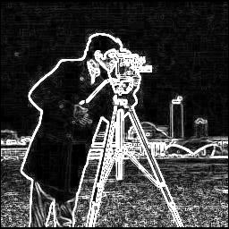

# Edge Detection using Sobel Filter

## Overview
This project implements **edge detection** using the **Sobel filter** in **VHDL**. The Sobel operator is a widely used method for edge detection in image processing, as it highlights regions of high spatial gradients.

## Features
- Uses **Sobel Filter** for edge detection.
- Implemented in **VHDL** for hardware acceleration.
- Works with **grayscale images** (e.g., 256x256 pixel images).
- Converts images into text-based matrices for processing.

## Input and Output
- **Input:** A grayscale image (e.g., `image_in.jpg`) converted into a numerical matrix (`input.txt`).
- **Processing:** The Sobel filter is applied to detect edges.
- **Output:** A processed edge-detected matrix (`output.txt`) which can be converted back to an image (`image_out.jpg`).

## Installation & Setup
1. Clone the repository:
   ```bash
   git clone https://github.com/your-username/Edge-Detection-VHDL.git
   cd Edge-Detection-VHDL
   ```
2. Ensure you have **GHDL** installed for VHDL simulation:
   ```bash
   sudo apt install ghdl
   ```
3. Compile and run the VHDL code:
   ```bash
   ghdl -a sobel_filter.vhd
   ghdl -e sobel_filter
   ghdl -r sobel_filter
   ```

## Usage
1. Convert an image to text format using Python:
   ```bash
   python img2txt.py image_in.jpg input.txt
   ```
2. Process the image using the VHDL Sobel filter:
   ```bash
   ghdl -r sobel_filter
   ```
3. Convert the processed text output back to an image:
   ```bash
   python txt2img.py output.txt image_out.jpg
   ```

## File Structure
- `sobel_filter.vhd` - VHDL implementation of the Sobel filter.
- `img2txt.py` - Python script to convert an image to a text matrix.
- `txt2img.py` - Python script to convert a text matrix back to an image.
- `input.txt` - Text representation of the input image.
- `output.txt` - Text representation of the edge-detected image.

## Example
Original Image → Edge Detection Process → Output Image:

 → 
